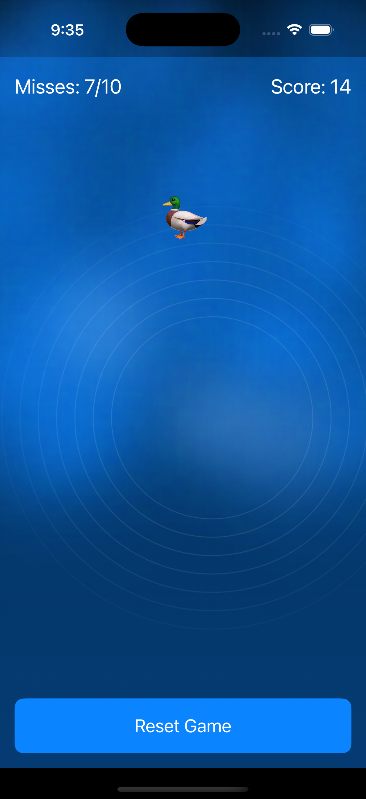
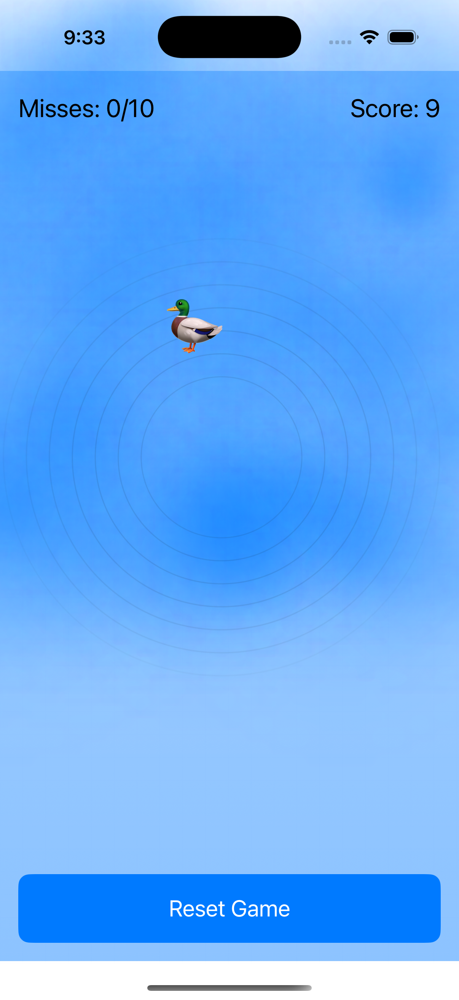
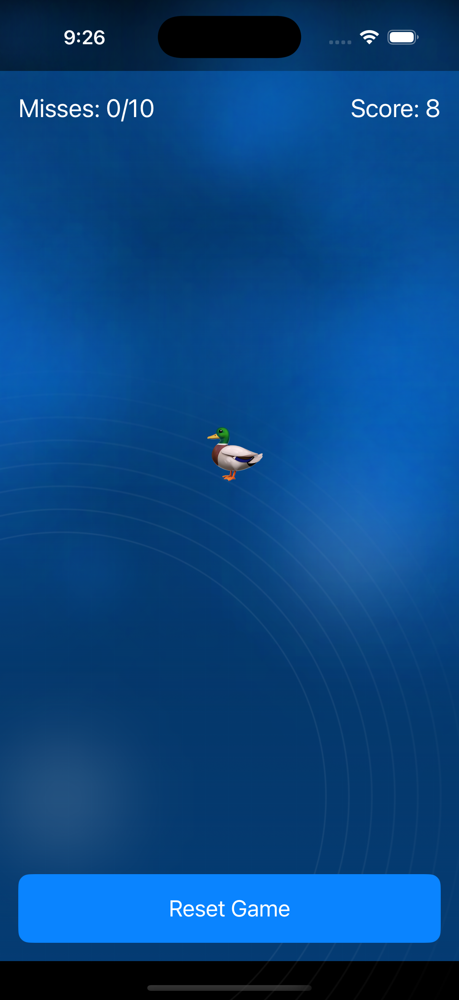

# Duck Chase with Ripples

A SwiftUI-based game where players tap ducks on a dynamic water surface. Features water ripple physics, haptic feedback, and increasing difficulty.


> [!TIP]
> This project was developed through an iterative prompting and feedback cycle with Anthropic's Claude 3.5 Sonnet AI, specifically exploring its capabilities in UI design and complex geometry handling. The development process showcases effective AI collaboration in creating interactive iOS applications.


## Screenshots

<div align="center">
  
  
  
</div>


## Features

- Dynamic water surface with realistic ripple effects
- Haptic feedback based on tap intensity
- Adaptive difficulty that increases over time
- Dark/light mode support
- Score tracking and miss counter
- Game over state with restart option
- Safe area-aware layout

## Gameplay

- Tap ducks before they disappear
- Each miss counts towards game over (20 misses max)
- Score increases with each successful hit
- More ducks appear as time progresses
- Ducks disappear faster at higher difficulty levels

## Technical Highlights

- Built with SwiftUI
- Uses Core Haptics for tactile feedback
- Custom water physics simulation
- Adaptive layout using GeometryReader
- Color scheme awareness
- Timer-based game loop
- Particle-like effects for water surface

## Installation

1. Clone the repository
2. Open `DuckRipples.xcodeproj` in Xcode
3. Build and run on a device or simulator

## Usage

```swift
import SwiftUI

struct ContentView: View {
    var body: some View {
        WaterRippleGame()
    }
}
```

## License

MIT License - see LICENSE file

## Contributing

1. Fork the repository
2. Create a feature branch
3. Commit changes
4. Push to the branch
5. Submit a pull request